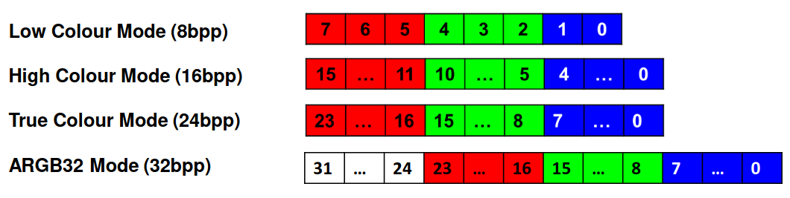

# Drawing images with your RPi (by Dylan Leclair)

To draw images on your baremetal RPi, you must convert them into a format that the RPi can read. 

One way you might accomplish this is using your favourite programming language and an image processing library to manually convert each pixel of the image into the format suitable for the RPi. 

For example, consider the function:
```python
# input is a 3 tuple of bytes representing R,G,B values (R,G,B)
def colorToARGB32(color):
    red = color[0]
    green = color[1]
    blue = color[2]
    # pack into 32 bit int
    result = 0
    result |= 0xFF << (8 * 3)
    result |=  red << (8 * 2)
    result |= green << (8 * 1)
    result |= blue
    # result is ARGB in bytes 0x00112233
    #                           AARRGGBB
    return result

```
which takes a pixel's color values and packs into a 32 bit ARGB color scheme, using a constant alpha value of 0xFF (max opacity).

Luckily for you, I've gone ahead and made a script to help make getting images going on your RPi easier.

Feel free to extend this script to add support for the other color modes on the Pi (see the Video Interface tutorial slides for more details).




## The script

The `convert.py` script needs a few things to run:
- python
- Pillow (a python library) - preinstalled on lab PCs! (https://pillow.readthedocs.io/en/stable/reference/Image.html)
- `image.h`, which is inlined below, to be placed in the source directory of your game.


### Running the script

First, you'll need a few images you want to draw on your Pi. I've included two example tiles from some tilemaps I found on itch.io with the downloads for this guide. 

I've placed my python script in the same directory as my makefile:

```
|-build
|-source
|   - framebuffer.h
|   - framebuffer.c
|   - main.c
|   - ...
|-makefile
|-convert.py
|-sample-tile.jpg
|-source-img.jpg
```

1. Place the `image.h` header file in your source directory.
2. Run `convert.py`, passing in the images you want to serialize into ARGB and draw on your Pi:
    - `python convert.py source-img.jpg sample-tile.jpg`
    - this will output the C code that you'll be passing to the Pi to load your images from! 
    - to automatically place it into your source code directory, in the same directory as your makefile, run: `python convert.py source-img.jpg sample-tile.jpg > source/image.c`
        - the `>` tells the shell to take the std output of the program and write it to `source/image.c`
3. Now, you can draw images in your source code! The `image.h` header exposes the `tilemaps` global variable, storing an array of pointers to  your images (see Image in `image.h` for the Image type definition).
3. Build and run your code!

For example in main, you might call the following code to draw your images: 

```c
/// main.c

#include "image.h"
/// ...

int main(void)
{
    /// ... init your framebuffer
	drawImage(10,10, &tilemap.images[0]);
	drawImage(42,10, &tilemap.images[1]);
}

```

The arrays are packed as a 1d buffer of pixel data, which can be drawn with the (inefficient) function:

```c
void drawImage(int x, int y, struct Image* img)
{
    int w = img->width;
    int h = img->height;
    for (int row = 0; row < h; row++)
    {
        for (int col = 0; col < w; col++)
        {
            // int color
            unsigned int color = img->data[row * w + col];
            // write the code to write a pixel at the right position
            drawPixel(x + col, y + row,color);
        }
    }
}
```

where you'll have to supply drawPixel :) (you can find resources to help you write it by checking out the video boilerplate on D2L).


## Appendix 

image.h:
```c
#pragma once
struct Image
{
    int width;  // # of cols
    int height; // # of rows
    unsigned int *data;
};

struct Tilemap {
    int count;
    struct Image images[];
};

extern struct Tilemap tilemap;
```
Email: `dylan.leclair1@ucalgary.ca` with any issues!